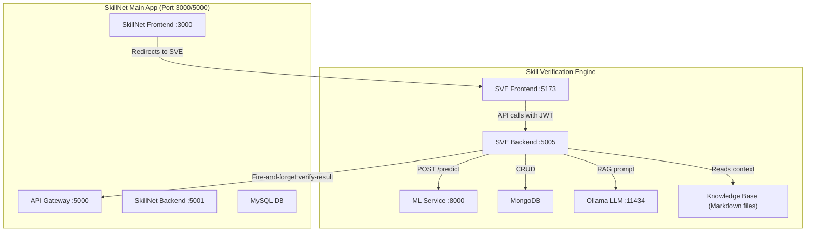
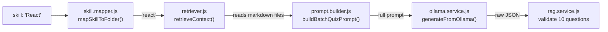
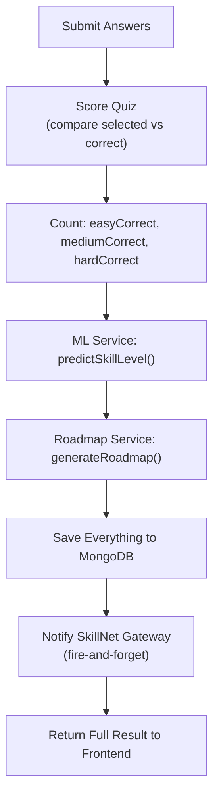
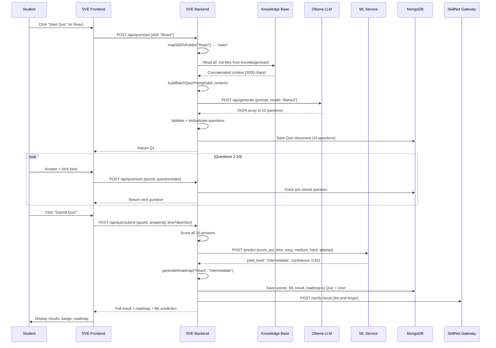

# Skill Verification Engine (SVE) — Complete Guide

## 1. What is SVE?

The **Skill Verification Engine** is a standalone microservice within SkillNet that verifies a student's technical skills through AI-generated quizzes. It combines three core technologies:

| Technology | Role |
|---|---|
| **RAG System** (Knowledge Base + Ollama LLM) | Generates quiz questions grounded in curated knowledge |
| **ML Service** (Python + scikit-learn) | Classifies skill level (Beginner/Intermediate/Advanced) from quiz results |
| **Roadmap Service** | Returns a personalized learning path based on the predicted level |

---

## 2. High-Level Architecture



### Port Map

| Service | Port |
|---|---|
| SVE Backend | `5005` |
| SVE Frontend | `5173` |
| ML Service | `8000` |
| Ollama | `11434` |
| MongoDB | `27017` (local) / `27018` (Docker) |

---

## 3. Authentication Bridge (SkillNet → SVE)

SVE does **not** have its own login system. It delegates authentication to SkillNet's JWT.

### How It Works

1. Student logs into **SkillNet** (MySQL-based, user gets a JWT containing `{ id, role, name }`)
2. SkillNet frontend stores the JWT in `localStorage`
3. When navigating to SVE, the **same JWT token** is passed via URL or localStorage
4. SVE Frontend reads the token and attaches it to every API request as `Authorization: Bearer <token>`

### Auth Middleware (`auth.middleware.js`)

```
JWT arrives → decode with shared JWT_SECRET
            → extract SkillNet ID (MySQL int)
            → create synthetic email: skillnet_{id}@bridge.local
            → Find-or-Create a MongoDB user with that email
            → attach user to req.user
```

> [!IMPORTANT]
> The `JWT_SECRET` must be identical in both SkillNet and SVE (`supersecretjwtkey123`). This is what makes the cross-service auth work.

The key trick: SVE auto-provisions a **local MongoDB user** keyed by a synthetic email derived from the SkillNet MySQL ID. This bridges the two different databases seamlessly.

---

## 4. The Quiz Flow — Step by Step

This is the core feature. Here's exactly what happens when a student takes a quiz:

### Step 1: Student Clicks "Start Quiz"

**Frontend** → `POST /api/quiz/start` with `{ skill: "React" }`

### Step 2: RAG Pipeline Generates 10 Questions

Inside `startQuiz()` controller, this chain executes:



#### 4a. Skill Mapper (`skill.mapper.js`)
Maps user input to a knowledge folder name:
- `"react"`, `"reactjs"`, `"react.js"` → all map to folder `"react"`
- `"python"`, `"python3"`, `"py"` → all map to folder `"python"`
- Supports 31 skills with 168+ aliases

#### 4b. Retriever (`retriever.js`)
- Reads ALL `.md` files from `Backend/src/knowledge/{folder}/`
- Concatenates them into a single string
- Truncates to **3000 characters** (to fit LLM context window)
- Example: for React, it reads `jsx.md`, `hooks.md`, `state.md`, `props.md`, `components.md`, `lifecycle.md`

#### 4c. Prompt Builder (`prompt.builder.js`)
Builds a strict prompt that tells Ollama to:
- Generate exactly **10** multiple-choice questions
- Follow difficulty distribution: **3 easy, 4 medium, 3 hard**
- Use ONLY the provided context (RAG grounding)
- Output a strict JSON array with fields: `question`, `options`, `correct_answer` (A/B/C/D), `difficulty`, `topic`
- No markdown, no explanation, just JSON

#### 4d. Ollama Service (`ollama.service.js`)
- Sends the prompt to Ollama's API (`http://localhost:11434/api/generate`)
- Uses model `llama3` (configurable via `OLLAMA_MODEL` env var)
- Sets `stream: false` for a single response
- Parses the JSON response (with repair logic for malformed JSON: smart quotes, trailing commas, etc.)

#### 4e. RAG Service (`rag.service.js`)
Validates the Ollama output:
- Must be an array of exactly 10 items
- Each question must have all required fields
- `difficulty` must be `"easy"`, `"medium"`, or `"hard"`
- `correct_answer` must be `"A"`, `"B"`, `"C"`, or `"D"`
- Retries up to **3 times** on validation failure

### Step 3: Duplicate Detection

Before storing:
1. Each question text is **SHA-256 hashed**
2. Hashes are checked against `QuizHistory` collection (per user + skill)
3. If duplicates found, regeneration is attempted once
4. New hashes are added to history via `$addToSet` (upsert)

### Step 4: Quiz Stored in MongoDB

All 10 questions are saved in a single `Quiz` document:

```javascript
{
  user: ObjectId,
  skill: "React",
  attempt_number: 1,
  status: "in_progress",
  questions: [
    {
      question: "What is JSX?",
      options: ["A templating...", "A CSS...", "A database...", "A server..."],
      correct_answer: "A",
      difficulty: "easy",
      topic: "JSX Syntax",
      selected_answer: null
    },
    // ... 9 more
  ]
}
```

### Step 5: First Question Returned to Frontend

Response to the frontend:
```json
{
  "success": true,
  "data": {
    "quizId": "abc123",
    "questionIndex": 0,
    "totalQuestions": 10,
    "question": { "question": "...", "options": [...], "difficulty": "easy", "topic": "..." }
  }
}
```

### Step 6: Student Answers Questions

For each subsequent question, frontend calls `POST /api/quiz/next` with `{ quizId, questionIndex }`. This simply retrieves the pre-generated question from the stored Quiz document — **no Ollama call happens here**.

The student's answers are tracked **client-side** until final submission.

### Step 7: Quiz Submission

`POST /api/quiz/submit` with:
```json
{
  "quizId": "abc123",
  "answers": [
    { "questionIndex": 0, "selected": "A" },
    { "questionIndex": 1, "selected": "C" },
    ...
  ],
  "timeTakenSec": 245
}
```

This triggers the **scoring + ML + roadmap pipeline**:



---

## 5. ML Service — Skill Level Prediction

### What It Does
Takes quiz performance metrics and predicts: **Beginner**, **Intermediate**, or **Advanced**.

### Architecture

| Component | File | Tech |
|---|---|---|
| Training Script | `ml_service/train.py` | scikit-learn LogisticRegression |
| Dataset Generator | `ml_service/generate_dataset.py` | NumPy + Pandas |
| Prediction API | `ml_service/api.py` | FastAPI + Uvicorn |
| Training Data | `ml_service/dataset.csv` | 1000 labeled rows |

### Input Features (6 features)

| Feature | Description | Range |
|---|---|---|
| `score_pct` | Overall score percentage | 0–100 |
| `time_taken_sec` | Total seconds taken | 60–900 |
| `easy_correct` | Easy questions correct | 0–3 |
| `medium_correct` | Medium questions correct | 0–4 |
| `hard_correct` | Hard questions correct | 0–3 |
| `attempt_number` | Which attempt (1st, 2nd, etc.) | 1–5 |

### How Training Works

1. `generate_dataset.py` creates 1000 synthetic rows using random values + rule-based labeling:
   - Score < 45% OR (score < 60% AND hard_correct ≤ 1) → **Beginner**
   - Score ≥ 80% AND hard_correct ≥ 2 AND medium_correct ≥ 3 → **Advanced**
   - Everything else → **Intermediate**

2. `train.py` reads `dataset.csv`, validates schema, then:
   - Encodes labels with `LabelEncoder`
   - Splits 80/20 train/test (stratified)
   - Scales features with `StandardScaler`
   - Trains `LogisticRegression(solver='lbfgs', max_iter=500)`
   - Saves 3 artifacts: `skill_model.pkl`, `scaler.pkl`, `label_encoder.pkl`

### How Prediction Works (Runtime)

1. SVE Backend calls `POST http://localhost:8000/predict` with quiz metrics
2. FastAPI loads the 3 pickle artifacts at startup
3. Builds feature vector → scales → predicts → returns:

```json
{
  "skill_level": "Intermediate",
  "confidence": 0.82,
  "probabilities": {
    "Beginner": 0.05,
    "Intermediate": 0.82,
    "Advanced": 0.13
  }
}
```

### Graceful Fallback
If the ML service is down or times out (5s limit), the backend returns `skill_level: "Unknown"` and continues — the quiz submission **never crashes**.

---

## 6. RAG System — Detailed Breakdown

**RAG = Retrieval-Augmented Generation**

Instead of letting the LLM hallucinate questions, we feed it curated knowledge so questions are grounded in facts.

### Knowledge Base Structure

```
Backend/src/knowledge/
├── react/
│   ├── jsx.md          (699 bytes)
│   ├── hooks.md        (813 bytes)
│   ├── state.md        (724 bytes)
│   ├── props.md        (752 bytes)
│   ├── components.md   (662 bytes)
│   └── lifecycle.md    (864 bytes)
├── javascript/
│   └── ...
├── python/
│   └── ...
└── ... (31 skill folders total)
```

Each `.md` file contains concise factual statements:
```markdown
# Example: hooks.md
Hooks are functions that let you use state and lifecycle features in functional components.
useState hook manages local component state.
useEffect hook handles side effects (data fetching, subscriptions, DOM updates).
...
```

### RAG Pipeline Summary

```
User says "React" 
  → skill.mapper: "react" folder
  → retriever: read all .md files, concat, truncate to 3000 chars
  → prompt.builder: embed context into strict quiz-generation prompt
  → ollama.service: send to Llama 3, parse JSON response
  → rag.service: validate 10 questions, retry up to 3x if invalid
```

---

## 7. Roadmap Service

After quiz submission, a **personalized learning roadmap** is generated based on the ML-predicted skill level.

### How It Works
- Roadmaps are **hardcoded JSON** (not LLM-generated) — this makes them instant and reliable
- Covers 9 skills with specific roadmaps: React, JavaScript, Node.js, Python, MongoDB, CSS, TypeScript, Git, Java
- Each skill has 3 levels (Beginner/Intermediate/Advanced)
- Unknown skills get a generic template

### Roadmap Data Structure
```javascript
{
  focus_areas: ["JSX syntax", "Functional components", ...],
  projects: ["Todo app", "Counter with reset", ...],
  resources: [
    { title: "React Official Docs", url: "https://react.dev/learn", type: "docs" },
    { title: "Scrimba Course", url: "...", type: "course" },
    { title: "YouTube Crash Course", url: "...", type: "video" }
  ],
  estimated_weeks: 4
}
```

### Persistence
`saveRoadmap()` upserts the roadmap into the user's `skillProfiles[]` array in MongoDB, using case-insensitive matching to avoid duplicate entries.

---

## 8. Database Schema (MongoDB)

### User Document
```javascript
{
  name: "John Doe",
  email: "skillnet_42@bridge.local",  // synthetic from SkillNet ID
  provider: "local",
  skills: ["React", "Python"],        // simple skill list
  skillProfiles: [                     // rich per-skill data
    {
      skill_name: "React",
      verified: true,
      verified_level: "Intermediate",
      last_quiz_score: 80,
      last_attempt_date: Date,
      roadmap: { focus_areas: [...], projects: [...], resources: [...] }
    }
  ],
  verifiedSkills: [                    // legacy badge system
    { skill: "React", badge: "Verified", verifiedAt: Date, score: 8, total: 10, percentage: 80 }
  ]
}
```

### Quiz Document
Stores the full quiz with all 10 questions, answers, scores, ML prediction, and status.

### QuizHistory Document
Tracks SHA-256 hashes of previously asked questions per (user, skill) pair to prevent repeats.

---

## 9. Verification Logic

A skill is **verified** when `scorePercent >= 70%`.

When verified, SVE:
1. Updates `verifiedSkills[]` and `skillProfiles[]` in MongoDB
2. Sends a **fire-and-forget** POST to SkillNet Gateway (`/api/skill-verification/verify-result`) so the main SkillNet dashboard also reflects the verification

---

## 10. Complete Data Flow Diagram



---

## 11. File Map Reference

### Backend (`Skill-Verification-Engine/Backend/src/`)

| File | Purpose |
|---|---|
| `server.js` | Entry point, loads env, starts Express on port 5005 |
| `app.js` | Express setup, CORS, route mounting |
| `config/db.js` | MongoDB connection via Mongoose |
| `middleware/auth.middleware.js` | JWT verification + auto-provisioning SVE user |
| `controllers/quiz.controller.js` | Start, next, submit, history endpoints |
| `controllers/skill.controller.js` | Add/delete skills, claim badge, roadmap fetch |
| `services/rag/skill.mapper.js` | Skill name → knowledge folder mapping (168+ aliases) |
| `services/rag/retriever.js` | Reads .md files from knowledge base |
| `services/rag/prompt.builder.js` | Builds the LLM prompt with RAG context |
| `services/rag/rag.service.js` | Orchestrates RAG pipeline with validation + retry |
| `services/ollama.service.js` | HTTP client for Ollama API + JSON repair |
| `services/mlService.js` | HTTP client for Python ML prediction API |
| `services/roadmapService.js` | Hardcoded roadmaps + save/generate logic |
| `models/user.model.js` | User schema with skillProfiles and verifiedSkills |
| `models/quiz.model.js` | Quiz schema with 10-question batch structure |
| `models/quizHistory.model.js` | Question hash tracking for deduplication |

### ML Service (`Skill-Verification-Engine/ml_service/`)

| File | Purpose |
|---|---|
| `generate_dataset.py` | Creates 1000-row synthetic training CSV |
| `dataset.csv` | Training data (1001 lines including header) |
| `train.py` | Trains LogisticRegression, saves .pkl artifacts |
| `api.py` | FastAPI server exposing `/predict` and `/health` |
| `skill_model.pkl` | Trained model artifact |
| `scaler.pkl` | StandardScaler artifact |
| `label_encoder.pkl` | LabelEncoder artifact |

---

## 12. Docker Deployment

All SVE services are defined in the root `docker-compose.yml`:

| Container | Image/Build | Internal Port |
|---|---|---|
| `sve-mongo` | `mongo:7` | 27017 → 27018 |
| `sve-backend` | Custom Dockerfile | 5005 |
| `sve-ml` | Custom Dockerfile | 8000 → 8001 |
| `sve-frontend` | Custom Dockerfile (Vite + Nginx) | 80 → 5173 |

Ollama runs on the **host machine** and is accessed via `host.docker.internal:11434`.

All services share the `skillnet-network` bridge network.
